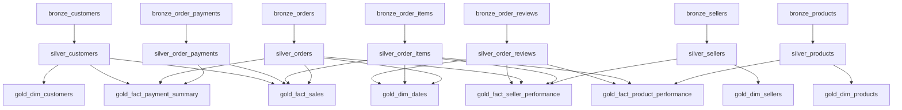

# Olist Databricks Medallion Lakehouse

Pipeline Lakehouse com arquitetura Medallion (Bronze → Silver → Gold) desenvolvido 100% no Databricks, utilizando Delta Lake, Auto Loader e Structured Streaming para processar o dataset público de e-commerce da Olist.

O objetivo foi aplicar, de forma prática e direta, os conceitos de Medallion Architecture no Databricks, cobrindo desde a ingestão incremental até a modelagem dimensional na camada Gold. O dataset da Olist foi escolhido por ser aberto, relacional e bem documentado.

Optei por notebooks genéricos para Bronze e Silver, parametrizados por arquivos YAML. Isso permite reaproveitamento de código e facilita a inclusão de novos datasets sem alterar a lógica central. O foco foi manter o projeto simples, funcional e fácil de entender, evitando abstrações desnecessárias.

---

## Tecnologias

| Lista |
|---|
| **Azure Databricks** |
| **Azure Data Lake Storage Gen2 (ADLS2)** | 
| **Delta Lake** |
| **Unity Catalog** |
| **Auto Loader (cloudFiles)** |
| **Azure Storage Container** |

---

## Como rodar

Este projeto roda apenas no Databricks. Nao ha suporte para execucao local com Spark standalone porque usa recursos nativos da plataforma: Auto Loader, Unity Catalog e Delta tables gerenciadas.

### Pré-requisitos

**Azure Databricks:**
- Cloud Azure
- Azure Databricks workspace provisionado
- Storage Account com Hierarchical Namespace habilitado (ADLS Gen2)
- Cluster com DBR 18.0
- Unity Catalog habilitado

**Free Edition:**
- Workspace Databricks Free Edition
- Cluster com DBR 18.0
- Unity Catalog habilitado

### Setup do ambiente  Azure Databricks

O Azure usa ADLS Gen2 como storage persistente. Todos os dados (landing, Delta tables Bronze/Silver/Gold, checkpoints e schema inference) ficam no ADLS2, fora do controle exclusivo do Databricks.

**1. Configurar o ADLS Gen2 (Portal Azure)**
1. Crie um Storage Account com **Hierarchical Namespace habilitado**
2. Crie o container `olist`

**2. Configurar External Location no Unity Catalog (Databricks UI)**
1. Catalog → icone de engrenagem → **Credential** → criar Storage Credential (Azure Managed Identity ou Service Principal)
2. Catalog → **External Locations** → `Create` → URL: `abfss://olist@<storage>.dfs.core.windows.net/` → vincular a credential criada
3. Clicar em **Test connection**  deve retornar OK

**3. Adicionar o repositório via Repos**

Va em **Repos** e adicione este repositório via Git.

**4. Rodar o bootstrap**

Execute `notebooks/setup/bootstrap_azure.ipynb`. O notebook pede o nome da Storage Account via widget e cria:
- Catalog `olist`
- Schemas `bronze`, `silver` e `gold` com `MANAGED LOCATION` apontando para o ADLS2  as Delta tables ficam fisicamente no seu storage
- `EXTERNAL VOLUME` para `files`, `checkpoints` e `schema`  os arquivos brutos e metadados do Auto Loader ficam no ADLS2

**5. Upload dos CSVs**

Faca o upload dos CSVs para o Workspace via UI e rode `notebooks/setup/copy_files_to_folder.ipynb`, que copia os arquivos para:

```
/Volumes/olist/landing/files/<nome_da_tabela>/
```

Alternativamente, use o Azure Storage Explorer para enviar os CSVs diretamente para o container ADLS2.

---

### Setup do ambiente  Free Edition

Execute `notebooks/setup/bootstrap_free_edition.ipynb`. O notebook cria o catalog `olist` com schemas e Volumes gerenciados pelo proprio Databricks (sem storage externo).

Apos o bootstrap, faca o upload dos CSVs no Workspace e rode `copy_files_to_folder.ipynb`.

### Adicionar o repositório ao Databricks

No workspace Databricks, va em **Repos** e adicione este repositório via Git. Ao rodar notebooks a partir de Repos, o Databricks adiciona automaticamente o caminho do repositório ao `sys.path` do cluster, tornando o código em `src/` importável sem nenhum `pip install` adicional.

### Executar via Job

O arquivo `job_databricks.yaml` define o job completo com todas as tasks e dependências. Para criar o job:

1. Ajuste `notebook_path` nas tasks para o caminho do seu Repo (substitua o email pelo seu)
2. Crie o job no Databricks via **Workflows → Create Job from YAML** ou pela CLI:

```bash
databricks jobs create --json @job_databricks.yaml
```

O job executa as camadas em paralelo onde possível, respeitando as dependências entre tasks.

---

## Variáveis de Execução por Notebook
O notebook é parametrizado para permitir o processamento dos notebooks genéricos.

**dataset**: Variável obrigatória que indica o nome do dataset (ex: customers). Ela é utilizada pelo script para localizar o arquivo de configuração(YAML) e iniciar o fluxo de ingestão e transformação.


---

## Diagrama do Job



As tasks de Bronze rodam todas em paralelo. Cada task de Silver depende somente da sua Bronze correspondente. As tasks de Gold aguardam as Silver de que dependem, conforme os relacionamentos do modelo.

---

## Arquitetura

```
CSVs (Volume landing)
        |
        v
   [ BRONZE ]   Auto Loader → Delta append-only
        |
        v
   [ SILVER ]   Structured Streaming + foreachBatch + MERGE (SCD Type 1)
        |
        v
   [ GOLD ]     Batch read + overwrite → Dimensions + Facts
```

### Bronze

A Bronze e a camada de aterrissagem. O Auto Loader monitora o Volume no Unity Catalog e ingere qualquer arquivo novo de forma incremental, sem precisar listar o diretorio inteiro a cada execucao. Nenhuma transformacao acontece aqui, os dados chegam exatamente como vieram dos CSVs. Dois campos de metadata sao adicionados automaticamente: `_ingest_ts` e `_source_file_path`. A escrita usa `trigger(availableNow=True)`, que processa tudo disponivel e encerra sem deixar um stream aberto.

### Silver

A Silver aplica schema tipado, deduplica por chave primaria e faz upsert via MERGE INTO com SCD Type 1. O `readStream.table()` le a Bronze de forma incremental via checkpoint, e dentro do `foreachBatch` um Window com `ROW_NUMBER()` garante que apenas o registro mais recente por chave chegue ao MERGE. Cada tabela Silver tem seu proprio YAML com schema explicito, chaves primarias e coluna de versao.


### Gold

Na Gold, as dimensões são processadas por um notebook genérico (`03_gold.ipynb`), que lê a configuração YAML e executa a seleção de colunas de forma parametrizada para cada dimensão. Isso permite reaproveitamento de código e facilita a manutenção.

Já as facts possuem notebooks próprios, cada um com sua lógica SQL específica, refletindo as regras e particularidades de cada fato de negócio. Cada notebook de fact executa as transformações necessárias e grava o resultado na tabela Gold correspondente, sempre em modo batch overwrite.

---

## Configuracao via YAML

A logica dos notebooks de Bronze e Silver e totalmente generica. O que varia entre datasets e o arquivo YAML em `conf/`. Isso foi uma das decisoes que mais gostei no projeto: adicionar um novo dataset nao exige nenhuma mudanca de codigo, so um novo YAML.

Exemplo (`conf/silver/orders.yaml`):

```yaml
dataset: orders
source:
  catalog: olist
  schema: bronze
  table: orders
target:
  catalog: olist
  schema: silver
  table: orders
schema:
  - column: order_id
    type: string
    nullable: false
  - column: order_status
    type: string
    nullable: true
  ...
keys:
  primary_keys: order_id
  version_column: _ingest_ts
```

---

## Gold Layer: Dimensoes e Fatos

### Dimensoes

| Tabela | Fonte Silver | Colunas principais |
|---|---|---|
| `dim_customers` | customers | customer_id, customer_unique_id, customer_city, customer_state |
| `dim_products` | products | product_id, product_category_name |
| `dim_sellers` | sellers | seller_id, seller_city, seller_state |
| `dim_dates` | gerada via Spark | date, year, month, quarter, day_of_week |

### Fatos

#### fact_sales
Faturamento consolidado por pedido. Cruza `orders`, `order_items` e `customers`.

- Qual o ticket medio por estado?
- Qual o volume de vendas por status (delivered, canceled)?
- Qual o tempo medio de entrega (purchase → delivered)?

#### fact_seller_performance
Performance individual por seller. Cruza `order_items`, `order_reviews`, `sellers` e `orders`.

- Quais sellers tem maior receita total?
- Qual a nota media por seller?
- Quais sellers tem mais pedidos atrasados (entrega > estimativa)?

#### fact_product_performance
Desempenho por produto e categoria. Cruza `order_items`, `order_reviews` e `products`.

- Quais categorias mais vendem em volume e receita?
- Qual a relacao entre peso/dimensao e frete cobrado?
- Quais produtos tem pior avaliacao media?

#### fact_payment_summary
Consolidado de pagamentos por pedido. Cruza `order_payments`, `orders` e `customers`.

- Qual o metodo de pagamento dominante por pedido?
- Qual o valor total pago, numero de metodos distintos e maximo de parcelas?
- Qual a distribuicao de pagamentos por estado do cliente?

A logica de metodo primario usa `ROW_NUMBER()` particionado por `order_id` e ordenado por `payment_value DESC`, garantindo que pedidos com multiplos metodos de pagamento tenham o metodo de maior valor identificado como primario.

---

## Estrutura do repositorio

```
conf/               # YAMLs de configuracao por camada e dataset
notebooks/
  setup/
    bootstrap_free_edition.ipynb  # Cria catalog, schemas, volumes (Free Edition)
    bootstrap_azure.ipynb         # Cria catalog, schemas, volumes (Azure)
  medallion/
    01_bronze.ipynb               # Ingestao Auto Loader (generico)
    02_silver.ipynb               # Streaming + MERGE SCD1 (generico)
    03_gold.ipynb                 # Dimensoes batch
    gold/                         # Um notebook por fact
      fact_sales.ipynb
      fact_seller_performance.ipynb
      fact_product_performance.ipynb
      fact_payment_summary.ipynb
      dim_dates.ipynb
src/
  config/             # Leitura dos YAMLs e parametros
  io/                 # reader.py e writer.py (abstraem Spark I/O)
  schema/             # Construcao dinamica de schema StructType
  spark/              # Inicializacao da SparkSession
  utils/              # Logging configurado
pyproject.toml        # Definicao do pacote Python
job_databricks.yaml   # Definicao do job Databricks Workflows
```

---

## Decisoes tecnicas

**Notebooks genericos com configuracao em YAML**
Essa foi a decisao central do projeto. Em vez de um notebook por dataset, os notebooks de Bronze e Silver sao genericos e leem a configuracao de um YAML. Queria aprender como fazer reaproveitamento de codigo sem criar abstrações que complicam mais do que ajudam. O mesmo principio se aplica ao job: um unico `job_databricks.yaml` orquestra todas as tasks, passando o `dataset` como parametro para os notebooks genericos.

**Repos em vez de pip install**
Ao referenciar notebooks via `/Repos/`, o Databricks adiciona automaticamente a raiz do repositório ao `sys.path`. Isso elimina a necessidade de instalar o pacote manualmente no cluster a cada mudança, tornando o ciclo de desenvolvimento e teste muito mais rapido.

**foreachBatch na Silver**
A Silver precisa de Window functions para deduplicacao e MERGE INTO para upsert. Esses recursos nao funcionam diretamente no Structured Streaming. O `foreachBatch` converte cada micro-batch em um DataFrame batch comum, habilitando comandos comuns do Spark SQL dentro do streaming.

**trigger(availableNow=True)**
Em vez de um stream persistente, o pipeline processa tudo disponivel e encerra. Ideal para execucao em jobs agendados e evita cluster ocioso.

**SCD Type 1 na Silver**
Os dados da Olist sao estáveis e nao precisam de historico de mudancas. Optei por SCD Type 1 (sobrescrever o registro existente pelo mais recente).

**Auto Loader em vez de leitura direta de CSV**
O Auto Loader rastreia quais arquivos ja foram processados via checkpoint, entao novas execucoes so processam arquivos novos, visando cargas diárias de novos dados.

**ADLS Gen2 com External Volumes e Managed Location**
No Azure, os schemas Bronze, Silver e Gold sao criados com `MANAGED LOCATION` apontando para o ADLS2. Isso garante que os arquivos Parquet do Delta ficam no storage da empresa, nao no storage interno do Databricks. Os Volumes de landing sao `EXTERNAL VOLUME`, o que significa que os arquivos CSV e os metadados do Auto Loader (checkpoints, schema inference) tambem residem no ADLS2 e sobrevivem a uma remocao do catalogo. Essa separacao entre metadados (UC) e dados fisicos (ADLS2) e o padrao corporativo em producao.

---

## Dataset

Dataset publico da Olist com cerca de 100 mil pedidos realizados entre 2016 e 2018 em multiplos marketplaces no Brasil.

Tabelas utilizadas: `customers`, `orders`, `order_items`, `order_payments`, `order_reviews`, `products`, `sellers`.

Link: https://www.kaggle.com/datasets/olistbr/brazilian-ecommerce

---
## Testes

Adicionei testes unitários e CI com GitHub Actions para validar automaticamente as funções principais do projeto.
[](https://github.com/gustavosass/olist-databricks-medallion-lakehouse/actions/workflows/ci-cd.yml)

---
## Resultados


